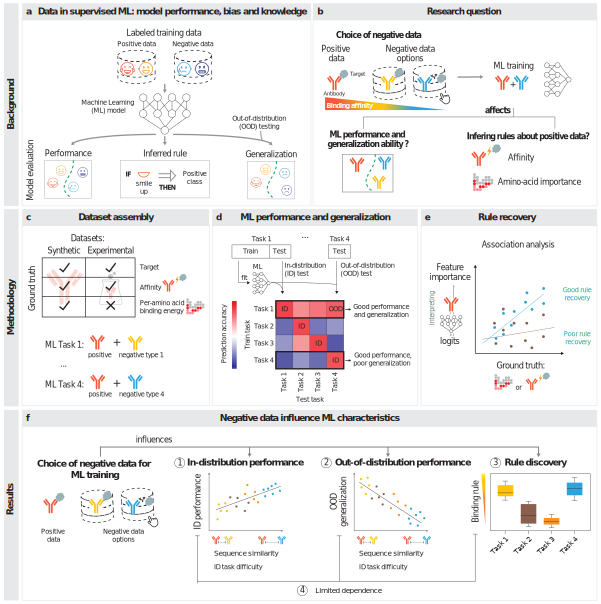

# Training data composition determines machine learning generalization and biological rule discovery


[Preprint](https://www.biorxiv.org/content/10.1101/2024.06.17.599333v2.abstract)



## Abstract
Supervised machine learning models depend on training datasets with positive and negative examples. Therefore, dataset composition directly impacts model performance and bias. Given the importance of machine learning for immunotherapeutic design, we examined how different negative class definitions affect model generalization and rule discovery for antibody-antigen binding. Using synthetic structure-based binding data, we evaluated models trained with various definitions of negative sets. Our findings reveal that high out-of-distribution performance can be achieved when the negative dataset contains more similar samples to the positive dataset despite a lower within-distribution performance. Furthermore, leveraging ground truth information, we show that binding rules discovered as associated with positive data change based on the negative data used. Validation on experimental data supported simulation-based observations. This work underscores the role of dataset composition, including negative data selection, in creating robust, generalizable, and biology-aware sequence-based ML models.

## Setup

### A. Environment
Once you've cloned the repository, install the environment using conda based on `environment.yml` file and install the local package.
```
conda env create --force --file environment.yml
conda activate nco
pip install -e src/NegativeClassOptimization
```

### B. Data

#### Absolut

Download `Absolut` data. Get the doi csv from [data source](https://archive.norstore.no/pages/public/toc.jsf?code=A3TL2NWADL), save it to data/Absolut/toc_doi10.11582_2021.00063.csv. Then run:

```
python scripts/script_01_build_datasets.py download_absolut
python scripts/script_01_build_datasets.py unzip_rawbindingsmurine
```

#### Experimental data

Download and unpack the dataset from https://zenodo.org/records/10123621.

## Precompute

We provide the precomputed results at `10.5281/zenodo.11191740`, following the instructions from the Readme of the data repository. If you want to compute the results from scratch, follow the instructions below. If not, skip to the next section.

Note 1: For testing/demo purposes, we recommend using smaller datasets to check the pipeline. Namely, in the code section below (1.) we recommend generating training datasets of 50 samples per class and testing datasets of 10 samples per class and following the pipeline with these datasets. Using this demo dataset, one can run the whole pipeline in 30-60 minutes depending on hardware. 

Note 2: The computations were run on a Linux system with 128GB RAM and 32 cores and they are designed to run in parallel (with 10-20 processes depending on the empirical load of each process). Each major computation took around 1-2 days to complete, depending on the dataset and the model. The most expensive computation is the computation of attributions, which took around 3 days. Expect about 1 week of compute time on a similar machine to reproduce all the results from scratch.

Follow the instructions to compute from scratch:

1. Generate the Miniabsolut dataset(s). Each MiniAbsolut dataset is a subset of the Absolut dataset with a specific number of samples per class for easier further assembly of training and test datasets, having already splitted training and test data, and removing duplicates and possible intersections. The script generates the datasets and saves them to `data/MiniAbsolut` and `data/MiniAbsolut_Splits`. Run:

```
# Build main dataset components, based on Absolut, called collectively MiniAbsolut 
python scripts/script_01_build_datasets.py miniabsolut 15000 5000
# [TEST] python scripts/script_01_build_datasets.py miniabsolut 50 10

# Process the experimental dataset
python scripts/script_01c_build_experimental.py

# Process the per-epitope datasets
python scripts/script_01d_build_epitope_datasets.py
```

2. Train the various models on the various datasets. Both SN10 (shallow neural network) and Logistic Regression models are trained.

Note: An `ANALYSIS_NAME` can be used to label the results, but it's optional and it's use is currently deprecated, e.g. you can use `main`. Multiple analyses can be organised by storing the results in different output folders. For docs of the CLI scripts, run `-h` or look into the python files which self-document straightforwardly the CLI arguments using `docopt`. 

```
# SN10: Absolut Synthetic Dataset
python scripts/script_02a_train_1v1.py "main" "data/Frozen_MiniAbsolut_ML" "0,1,2,3" "0,1,2,3,4"
python scripts/script_02b_train_1v9.py "main" "data/Frozen_MiniAbsolut_ML" "0,1,2,3" "0,1,2,3,4"
python scripts/script_02c_train_high_vs_looser_95low.py "main" "data/Frozen_MiniAbsolut_ML" "0,1,2,3" "0,1,2,3,4"

# SN10: Shuffled Negative Controls
python scripts/script_02a_train_1v1.py "main" "data/Frozen_MiniAbsolut_ML_shuffled" "0,1,2,3" "0,1,2,3,4" --shuffle_labels 
python scripts/script_02b_train_1v9.py "main" "data/Frozen_MiniAbsolut_ML_shuffled" "0,1,2,3" "0,1,2,3,4" --shuffle_labels 
python scripts/script_02c_train_high_vs_looser_95low.py "main" "data/Frozen_MiniAbsolut_ML_shuffled" "0,1,2,3" "0,1,2,3,4" --shuffle_labels 

# Logistic Regression: Absolut Synthetic Dataset
python scripts/script_02a_train_1v1.py "main" "data/Frozen_MiniAbsolut_ML_Linear" "0,1,2,3" "0,1,2,3,4" --logistic_regression 
python scripts/script_02b_train_1v9.py "main" "data/Frozen_MiniAbsolut_ML_Linear" "0,1,2,3" "0,1,2,3,4" --logistic_regression
python scripts/script_02c_train_high_vs_looser_95low.py "main" "data/Frozen_MiniAbsolut_ML_Linear" "0,1,2,3" "0,1,2,3,4" --logistic_regression 

# SN10: Porebski Experimental Dataset
python scripts/script_02a_train_1v1.py "main" "data/Frozen_MiniAbsolut_ML" "0,1,2,3" "0,1,2,3,4" --experimental
python scripts/script_02c_train_high_vs_looser_95low.py "main" "data/Frozen_MiniAbsolut_ML" "0,1,2,3" "0,1,2,3,4" --experimental

# SN10: Per-epitope datasets
python scripts/script_02a_train_1v1.py "main" "data/Frozen_MiniAbsolut_ML" "0,1,2,3" "0,1,2,3,4" --epitopes
python scripts/script_02b_train_1v9.py "main" "data/Frozen_MiniAbsolut_ML" "0,1,2,3" "0,1,2,3,4" --epitopes
python scripts/script_02c_train_high_vs_looser_95low.py "main" "data/Frozen_MiniAbsolut_ML" "0,1,2,3" "0,1,2,3,4" --epitopes

# SN10: Absolut Synthetic Dataset: x10 less data
python scripts/script_02b_train_1v9.py "main" "data/Frozen_MiniAbsolut_ML_x10under" "0,1,2,3" "0,1,2,3,4" --x10under
python scripts/script_02c_train_high_vs_looser_95low.py "main" "data/Frozen_MiniAbsolut_ML_x10under" "0,1,2,3" "0,1,2,3,4" --x10under

# SN10: Absolut Synthetic Dataset: x50 less data
python scripts/script_02b_train_1v9.py "main" "data/Frozen_MiniAbsolut_ML_x50under" "0,1,2,3" "0,1,2,3,4" --x50under
python scripts/script_02c_train_high_vs_looser_95low.py "main" "data/Frozen_MiniAbsolut_ML_x50under" "0,1,2,3" "0,1,2,3,4" --x50under

# Transformer - Parameter search: Experimental Dataset
python scripts/script_02c_train_high_vs_looser_95low.py "main" "data/Frozen_MiniAbsolut_ML_Transformer_Parameters_Experimental" "0" "1,2" --experimental --transformer

# Transformer - Parameter search: Absolut Dataset
python scripts/script_02a_train_1v1.py "main" "data/Frozen_MiniAbsolut_ML_Transformer_Parameters_Absolut" "0" "0,1" --transformer
python scripts/script_02b_train_1v9.py "main" "data/Frozen_MiniAbsolut_ML_Transformer_Parameters_Absolut" "0" "1,2" --transformer
python scripts/script_02c_train_high_vs_looser_95low.py "main" "data/Frozen_MiniAbsolut_ML_Transformer_Parameters_Absolut" "0" "1,2" --transformer

# SN10: Absolut Dataset - with Epochs to reevaluate overfitting
python scripts/script_02a_train_1v1.py "main" "data/Frozen_MiniAbsolut_ML_Fitcheck" "0" "0,1,2" --overfitting_check
python scripts/script_02b_train_1v9.py "main" "data/Frozen_MiniAbsolut_ML_Fitcheck" "0" "0,1,2" --overfitting_check
python scripts/script_02c_train_high_vs_looser_95low.py "main" "data/Frozen_MiniAbsolut_ML_Fitcheck" "0" "0,1,2" --overfitting_check

# SN10: Embeddings
python scripts/script_02b_train_1v9.py "main" "data/Frozen_MiniAbsolut_ML_esm2b" "0" "" --esm2b
python scripts/script_02c_train_high_vs_looser_95low.py "main" "data/Frozen_MiniAbsolut_ML_esm2b" "0" "" --esm2b
python scripts/script_02b_train_1v9.py "main" "data/Frozen_MiniAbsolut_ML_antiberta2" "0" "" --antiberta2
python scripts/script_02c_train_high_vs_looser_95low.py "main" "data/Frozen_MiniAbsolut_ML_antiberta2" "0" "" --antiberta2

# SN10: Embeddings - Experimental Dataset
### Generate fastas: python scripts/script_01_build_datasets.py make_fasta_porbebski
### Run the embeddings generator (from embedairr)
python scripts/script_02c_train_high_vs_looser_95low.py "main" "data/Frozen_MiniAbsolut_ML_esm2b_experimental" "0" "" --experimental --esm2b
python scripts/script_02c_train_high_vs_looser_95low.py "main" "data/Frozen_MiniAbsolut_ML_antiberta2_experimental" "0" "" --experimental --antiberta2
```

3. Compute the ID and OOD performances.

```
# ID, OOD: Absolut Synthetic Dataset
python scripts/script_03_evaluate_performance.py 1 0 "data/Frozen_MiniAbsolut_ML" "data/Frozen_MiniAbsolut_ML/closed_performance.tsv" "data/Frozen_MiniAbsolut_ML/openset_performance.tsv"
python scripts/script_03_evaluate_performance.py 0 1 "data/Frozen_MiniAbsolut_ML" "data/Frozen_MiniAbsolut_ML/closed_performance.tsv" "data/Frozen_MiniAbsolut_ML/openset_performance.tsv"

# ID, OOD: Shuffled Negative Controls
python scripts/script_03_evaluate_performance.py 1 0 "data/Frozen_MiniAbsolut_ML_shuffled" "data/Frozen_MiniAbsolut_ML_shuffled/closed_performance.tsv" "data/Frozen_MiniAbsolut_ML_shuffled/openset_performance.tsv"
python scripts/script_03_evaluate_performance.py 0 1 "data/Frozen_MiniAbsolut_ML_shuffled" "data/Frozen_MiniAbsolut_ML_shuffled/closed_performance.tsv" "data/Frozen_MiniAbsolut_ML_shuffled/openset_performance.tsv"

# ID, OOD: Logistic Regression
python scripts/script_03_evaluate_performance.py 1 0 "data/Frozen_MiniAbsolut_ML_Linear" "data/Frozen_MiniAbsolut_ML_Linear/closed_performance.tsv" "data/Frozen_MiniAbsolut_ML_Linear/openset_performance.tsv"
python scripts/script_03_evaluate_performance.py 0 1 "data/Frozen_MiniAbsolut_ML_Linear" "data/Frozen_MiniAbsolut_ML_Linear/closed_performance.tsv" "data/Frozen_MiniAbsolut_ML_Linear/openset_performance.tsv"

# ID, OOD: Experimental Dataset
python scripts/script_03_evaluate_performance.py 1 0 "data/Frozen_MiniAbsolut_ML" "data/Frozen_MiniAbsolut_ML/closed_performance_experimental_data.tsv" "data/Frozen_MiniAbsolut_ML/openset_performance_experimental_data.tsv"
python scripts/script_03_evaluate_performance.py 0 1 "data/Frozen_MiniAbsolut_ML" "data/Frozen_MiniAbsolut_ML/closed_performance_experimental_data.tsv" "data/Frozen_MiniAbsolut_ML/openset_performance_experimental_data.tsv"

# ID, OOD: Per-epitope datasets
python scripts/script_03b_evaluate_performance_epitopes.py 1 0 "data/Frozen_MiniAbsolut_ML" "data/Frozen_MiniAbsolut_ML/closed_performance_epitopes_pos.tsv" "data/Frozen_MiniAbsolut_ML/openset_performance_epitopes_pos.tsv"
python scripts/script_03b_evaluate_performance_epitopes.py 0 1 "data/Frozen_MiniAbsolut_ML" "data/Frozen_MiniAbsolut_ML/closed_performance_epitopes_pos.tsv" "data/Frozen_MiniAbsolut_ML/openset_performance_epitopes_pos.tsv"
python scripts/script_03c_jsd_epitopes.py

# ID, OOD: Transformer - Experimental Dataset
python scripts/script_03_evaluate_performance.py 1 0 "data/Frozen_MiniAbsolut_ML_Transformer_Parameters_Experimental/transformer_parameterset_085feb71" "data/Frozen_MiniAbsolut_ML_Transformer_Parameters_Experimental/transformer_parameterset_085feb71/closed_performance.tsv" "data/Frozen_MiniAbsolut_ML_Transformer_Parameters_Experimental/transformer_parameterset_085feb71/openset_performance.tsv" --experimental --transformer
python scripts/script_03_evaluate_performance.py 0 1 "data/Frozen_MiniAbsolut_ML_Transformer_Parameters_Experimental/transformer_parameterset_085feb71" "data/Frozen_MiniAbsolut_ML_Transformer_Parameters_Experimental/transformer_parameterset_085feb71/closed_performance.tsv" "data/Frozen_MiniAbsolut_ML_Transformer_Parameters_Experimental/transformer_parameterset_085feb71/openset_performance.tsv"  --experimental --transformer

# ID, OOD: Transformer - Absolut Dataset
python scripts/script_03_evaluate_performance.py 1 0 "data/Frozen_MiniAbsolut_ML_Transformer_Parameters_Absolut/transformer_parameterset_a764f9c7" "data/Frozen_MiniAbsolut_ML_Transformer_Parameters_Absolut/transformer_parameterset_a764f9c7/closed_performance.tsv" "data/Frozen_MiniAbsolut_ML_Transformer_Parameters_Absolut/transformer_parameterset_a764f9c7/openset_performance.tsv" --transformer
python scripts/script_03_evaluate_performance.py 0 1 "data/Frozen_MiniAbsolut_ML_Transformer_Parameters_Absolut/transformer_parameterset_a764f9c7" "data/Frozen_MiniAbsolut_ML_Transformer_Parameters_Absolut/transformer_parameterset_a764f9c7/closed_performance.tsv" "data/Frozen_MiniAbsolut_ML_Transformer_Parameters_Absolut/transformer_parameterset_a764f9c7/openset_performance.tsv" --transformer

# ID, OOD: x10 less data Absolut SN10
python scripts/script_03_evaluate_performance.py 1 0 "data/Frozen_MiniAbsolut_ML_x10under" "data/Frozen_MiniAbsolut_ML_x10under/closed_performance.tsv" "data/Frozen_MiniAbsolut_ML_x10under/openset_performance.tsv"
python scripts/script_03_evaluate_performance.py 0 1 "data/Frozen_MiniAbsolut_ML_x10under" "data/Frozen_MiniAbsolut_ML_x10under/closed_performance.tsv" "data/Frozen_MiniAbsolut_ML_x10under/openset_performance.tsv"

# ID, OOD: x50 less data Absolut SN10
python scripts/script_03_evaluate_performance.py 1 0 "data/Frozen_MiniAbsolut_ML_x50under" "data/Frozen_MiniAbsolut_ML_x50under/closed_performance.tsv" "data/Frozen_MiniAbsolut_ML_x50under/openset_performance.tsv"
python scripts/script_03_evaluate_performance.py 0 1 "data/Frozen_MiniAbsolut_ML_x50under" "data/Frozen_MiniAbsolut_ML_x50under/closed_performance.tsv" "data/Frozen_MiniAbsolut_ML_x50under/openset_performance.tsv"

# ID, OOD: SN10 with PLM Embeddings - Absolut Dataset
python scripts/script_03_evaluate_performance.py 1 0 "data/Frozen_MiniAbsolut_ML_esm2b" "data/Frozen_MiniAbsolut_ML_esm2b/closed_performance.tsv" "data/Frozen_MiniAbsolut_ML_esm2b/openset_performance.tsv" --esm2b
python scripts/script_03_evaluate_performance.py 0 1 "data/Frozen_MiniAbsolut_ML_esm2b" "data/Frozen_MiniAbsolut_ML_esm2b/closed_performance.tsv" "data/Frozen_MiniAbsolut_ML_esm2b/openset_performance.tsv" --esm2b
python scripts/script_03_evaluate_performance.py 1 0 "data/Frozen_MiniAbsolut_ML_antiberta2" "data/Frozen_MiniAbsolut_ML_antiberta2/closed_performance.tsv" "data/Frozen_MiniAbsolut_ML_antiberta2/openset_performance.tsv" --antiberta2
python scripts/script_03_evaluate_performance.py 0 1 "data/Frozen_MiniAbsolut_ML_antiberta2" "data/Frozen_MiniAbsolut_ML_antiberta2/closed_performance.tsv" "data/Frozen_MiniAbsolut_ML_antiberta2/openset_performance.tsv" --antiberta2

# ID, OOD: SN10 with PLM Embeddings - Experimental Dataset
python scripts/script_03_evaluate_performance.py 1 0 "data/Frozen_MiniAbsolut_ML_esm2b_experimental" "data/Frozen_MiniAbsolut_ML_esm2b_experimental/closed_performance.tsv" "data/Frozen_MiniAbsolut_ML_esm2b_experimental/openset_performance.tsv" --experimental --esm2b
python scripts/script_03_evaluate_performance.py 0 1 "data/Frozen_MiniAbsolut_ML_esm2b_experimental" "data/Frozen_MiniAbsolut_ML_esm2b_experimental/closed_performance.tsv" "data/Frozen_MiniAbsolut_ML_esm2b_experimental/openset_performance.tsv" --experimental --esm2b
python scripts/script_03_evaluate_performance.py 1 0 "data/Frozen_MiniAbsolut_ML_antiberta2_experimental" "data/Frozen_MiniAbsolut_ML_antiberta2_experimental/closed_performance.tsv" "data/Frozen_MiniAbsolut_ML_antiberta2_experimental/openset_performance.tsv" --experimental --antiberta2
python scripts/script_03_evaluate_performance.py 0 1 "data/Frozen_MiniAbsolut_ML_antiberta2_experimental" "data/Frozen_MiniAbsolut_ML_antiberta2_experimental/closed_performance.tsv" "data/Frozen_MiniAbsolut_ML_antiberta2_experimental/openset_performance.tsv" --experimental --antiberta2

```

4. Run the interpretability pipeline.

Get [Absolut!](https://github.com/csi-greifflab/Absolut): clone the library, install AbsolutNoLib (according to the instructions), and save the path to the `AbsolutNoLib` in the environment variable `ABSOLUTNOLIB_PATH`.

```
export ABSOLUTNOLIB_PATH=$PWD/AbsolutNoLib

# Compute the energy contributions using Absolut. Note: to restrict computational costs the computation is done only for the main MiniAbsolut train/test split and one of the seeds. 
python scripts/script_04a_energy_per_residue.py
```

Note: if the latest Absolut! doesn't work below, reset to an earlier commit that was used in this work by running: `git reset --hard 0f672a19c9fdec561e4d6d2470471ea016f949ad`.

Next: compute the attributions.
- Note: to sort out different attributions on the same models/data, one can use the `ATTRIBUTOR_NAME` argument. Correspondingly, one has to adapt the analysis notebook to use the right attributions (explained in the notebooks).

```
# Interpretability: SN10
python scripts/script_04b_attributions.py "{ATTRIBUTOR_NAME}" "data/Frozen_MiniAbsolut_ML"

# Interpretability: Shuffled negative control
python scripts/script_04b_attributions.py "{ATTRIBUTOR_NAME}" "data/Frozen_MiniAbsolut_ML_shuffled"

# Interpretability: Logistic Regression: No need to run DeepLift, it's based on the model weights (done in Analyses).
python scripts/script_01_build_datasets.py adapt_attributions_for_linear

# Interpretability: Experimental Dataset
python scripts/script_04b_attributions.py "{ATTRIBUTOR_NAME}" "data/Frozen_MiniAbsolut_ML" --experimental

# Interpretability: Per-epitope datasets
python scripts/script_04b_attributions.py "{ATTRIBUTOR_NAME}" "data/Frozen_MiniAbsolut_ML" --epitopes_only "PositiveSet_Epitope"
```

## Analyse

Once we have the precomputations (either downloaded or precomputed from scratch using the steps from above), we perform the analyses using notebooks. Note that we provide another layer of precomputed results tsv files in this code repository (in `/data`), which are used in the notebooks. If you want to run the notebooks from scratch, you can do so by following the notebooks and rerunning the computations involved in generating the tsv files.

### Notebook map:

Section 1: Training dataset sequence composition influences prediction performance in ID and OOD binary classification tasks
- ID and OOD on synthetic data and sequence similarity: `0a1_Section_1.ipynb`.
- ID and OOD on experimental data: `0a3_Section_1_experimental.ipynb`.

Section 2: Training dataset composition determines the accuracy of biological rule recovery
- Correlations between ground truth energy per sequence and per amino acid and logits / attributions: `0b_Section_2.ipynb`.
- Correlation between binding strength and logit in the experimental dataset: `0b3_Section_2_experimental.ipynb`.

Supplementary Materials
- Negative control: shuffled positive and negative in training sets labels: `0a2_Section_1_shuffled.ipynb`, `0b2_Section_2_shuffled.ipynb`
- Logistic models: `0a4_Section_1_logistic.ipynb`, `0b4_Section_2_logistic.ipynb`

Supplementary Text 1: Evaluation of the impact of sequence and label similarity between train and test on prediction accuracy 

Supplementary Text 2: Epitope-based analysis: ID, OOD, rule discovery
- `0s2_Epitope-based_Section_1_and_2.ipynb`

